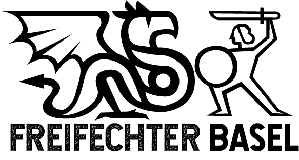
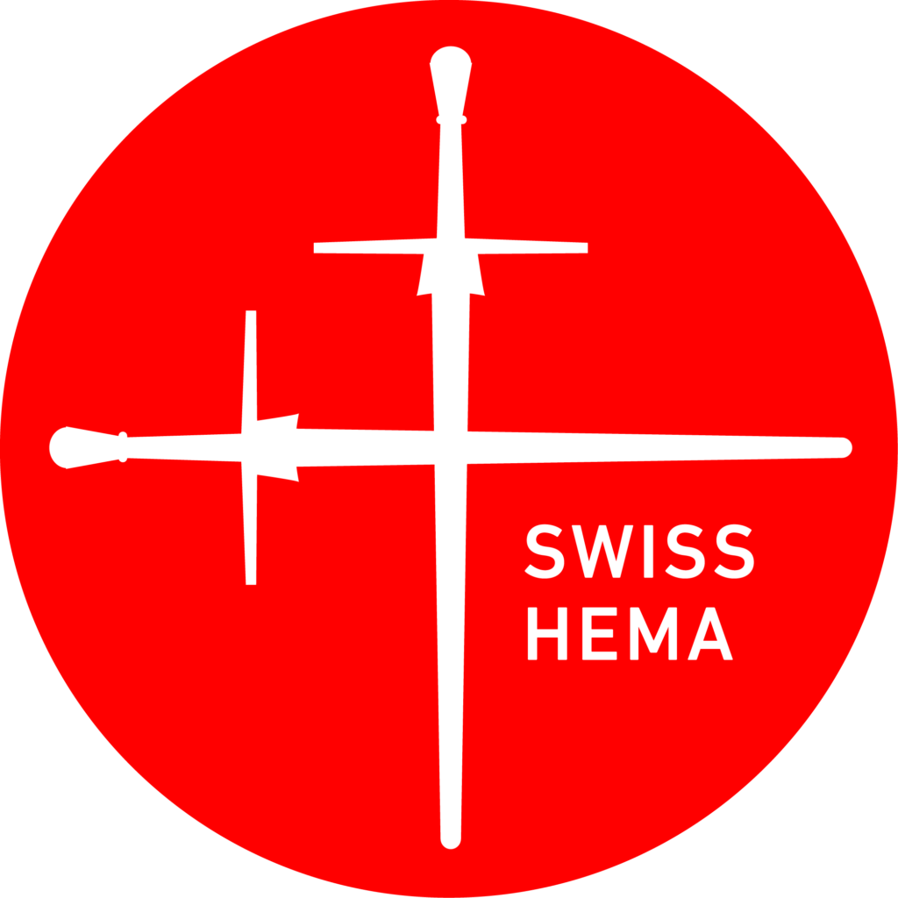
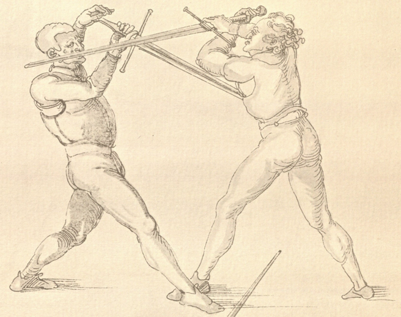
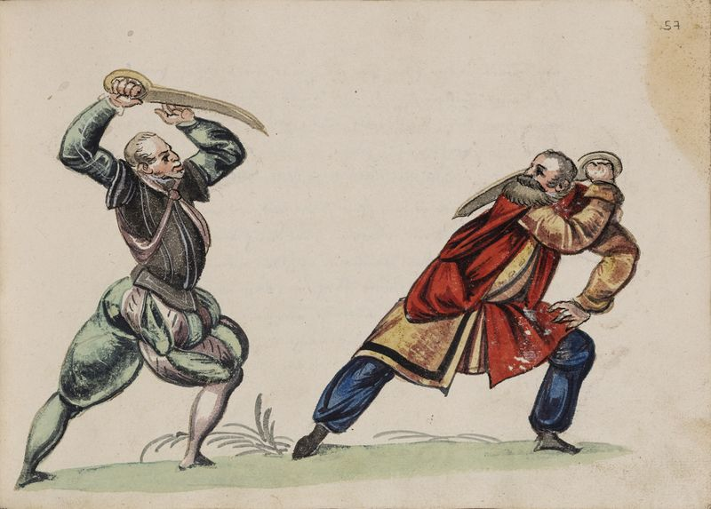
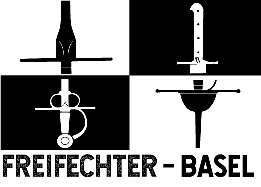

::: {.column-margin}
::: {.content-visible when-profile="en"}
## Training Schedule
:::
+------------+-------------+-------------------------------------------------------------------+-----------------+
| Day        | Hour        | Where                                                             | What            |
+============+=============+===================================================================+=================+
| Mondays    | 18:15-20:00 | Theaterstrasse 12  4051 Basel  Turnhalle oben               | Longsword class |
+------------+-------------+-------------------------------------------------------------------+-----------------+
| Tuesdays   | 20:00-21:45 | Theaterstrasse 12  4051 Basel  Turnhalle unten              | Open sparring   |
+------------+-------------+-------------------------------------------------------------------+-----------------+
| Wednesdays | 18:00-19:30 | Kohlenberggasse 11 4055 Basel Beruffachschule Turnhalle UG1 | Rapier class    |
+------------+-------------+-------------------------------------------------------------------+-----------------+
| Wednesdays | 19:30-21:00 | Kohlenberggasse 11 4055 Basel Beruffachschule Turnhalle UG1 | Longsword class |
+------------+-------------+-------------------------------------------------------------------+-----------------+
| Wednesdays | 21:00-22:00 | Kohlenberggasse 11 4055 Basel Beruffachschule Turnhalle UG1 | Sparring        |
+------------+-------------+-------------------------------------------------------------------+-----------------+
::: {.callout-warning}
During sommer vacation - June 29 to August 9 - we train on Wednesday 18:00-20:00 at Nonnenweg 36.
:::

::: {.content-visible when-profile="fr"}
## Entraînements
+------------+-------------+-------------------------------------------------------------------+-----------------+
| Jour       | Heure       | Lieu                                                              | Activité        |
+============+=============+===================================================================+=================+
| Lundis     | 18:15-20:00 | Theaterstrasse 12  4051 Basel  Turnhalle oben               | Epée longue     |
+------------+-------------+-------------------------------------------------------------------+-----------------+
| Mardis     | 20:00-21:45 | Theaterstrasse 12  4051 Basel  Turnhalle unten              | Assauts libres  |
+------------+-------------+-------------------------------------------------------------------+-----------------+
| Mercredis  | 18:00-19:30 | Kohlenberggasse 11 4055 Basel Beruffachschule Turnhalle UG1 | Rapière         |
+------------+-------------+-------------------------------------------------------------------+-----------------+
| Mercredis  | 19:30-21:00 | Kohlenberggasse 11 4055 Basel Beruffachschule Turnhalle UG1 | Epée longue     |
+------------+-------------+-------------------------------------------------------------------+-----------------+
| Mercredis  | 21:00-22:00 | Kohlenberggasse 11 4055 Basel Beruffachschule Turnhalle UG1 | Assauts         |
+------------+-------------+-------------------------------------------------------------------+-----------------+
::: {.callout-warning}
Pendant les vacances d'été - du 29 juin au 9 août - nous nous entraînons le mercredi de 18h00 à 20h00 au Nonnenweg 36.
:::

::: {.content-visible when-profile="de"}
## Wochentrainings
+------------+-------------+-------------------------------------------------------------------+-----------------+
| Tag        | Uhr         | Ort                                                               | Was             |
+============+=============+===================================================================+=================+
| Montags    | 18:15-20:00 | Theaterstrasse 12  4051 Basel  Turnhalle oben               | Langschwert     |
+------------+-------------+-------------------------------------------------------------------+-----------------+
| Dienstags  | 20:00-21:45 | Theaterstrasse 12  4051 Basel  Turnhalle unten              | Open sparring   |
+------------+-------------+-------------------------------------------------------------------+-----------------+
| Mittwochs  | 18:00-19:30 | Kohlenberggasse 11 4055 Basel Beruffachschule Turnhalle UG1 | Rapier          |
+------------+-------------+-------------------------------------------------------------------+-----------------+
| Mittwochs  | 19:30-21:00 | Kohlenberggasse 11 4055 Basel Beruffachschule Turnhalle UG1 | Langschwert     |
+------------+-------------+-------------------------------------------------------------------+-----------------+
| Mittwochs  | 21:00-22:00 | Kohlenberggasse 11 4055 Basel Beruffachschule Turnhalle UG1 | Sparring        |
+------------+-------------+-------------------------------------------------------------------+-----------------+
::: {.callout-warning}
Während der Sommerferien vom 29. Juni bis 9. August trainieren wir am Mittwoch von 18:00 bis 20:00 Uhr im Nonnenweg 36.
:::
{width=120%}
{width=60%  fig-align="center"}

:::

::: {style="font-size: 150%;"}

::: {.content-visible when-profile="en"}
We are a historical fencing club based in Basel focusing mainly, but not only, on late middle-age and early renaissance fencing.
:::

::: {.content-visible when-profile="fr"}
Nous sommes un club d'escrime historique, basés à Basel.
Nous nous concentrons majoritairement, mais pas uniquement, sur l'escrime de la fin du moyen-âge et du début de la renaissance.
:::

::: {.content-visible when-profile="de"}
Wir sind ein Basler historischer Fechtclub, dessen Schwerpunkt hauptsächlich, aber nicht ausschließlich, auf Fechten im Spätmittelalter und in der Frührenaissance.
:::

:::

::: {.content-visible when-profile="en"}
## Our Club
:::

::: {.content-visible when-profile="fr"}
## Notre club
:::

::: {.content-visible when-profile="de"}
## Unser Verein
:::

::: {.img-float}
{style="float: left; margin: 25px;" width=50%}
:::

::: {.content-visible when-profile="en"}

We are a club that offers a social and friendly learning environment for anyone interested in the medieval, renaissance and early modern martial arts of Europe. Our democratic club structures allows for the integration of any person regardless of age, gender, race or ability. Our competencies encompass most weapon classes and unarmed combat. Due to popular request we have been specializing in swords, both single- and twohanded ones.

:::

::: {.content-visible when-profile="fr"}

Notre association souhaite offrir un cadre amical et positif pour l'apprentissage des art-martiaux de l'Europe médiévale et moderne. 
Notre structure associative démocratique acceuille tout le monde, indépendamment de leur âge, leur genre, leur origine, ou leur compétence.

Nos connaissances et compétences actuelles recouvrent de nombreuses armes et techniques non-armées, même si, pour des raisons de popularité, nous nous concentrons actuellement majoritairement sur le manienment de l'épée longue selon la tradition germanique.

:::

::: {.content-visible when-profile="de"}

Wir sind ein Verein, der ein freundliches und soziales Lernumfeld bietet für alle, die an den mittelalterlichen und neuzeitlichen Kampfkünsten Europas interessiert sind. Unsere demokratische Clubstruktur, sowie unsere persönliche Betreuung ermöglichen die Integration von Menschen jeglichen Alters, Geschlechts, Hautfarbe oder sonstiger Konstitution. Unser Kompetenzbereich umfasst die meisten Waffengattungen, sowie den unbewaffneten Kampf. Aufgrund der aktuellen Nachfrage spezialisieren wir uns auf Schwerter, ob ein- oder zweihändig geführt.

:::

## HEMA

::: {.content-visible when-profile="en"}

Historical European Martial Arts is a blanket term that unites a broad variety of martial arts that were and still are practiced in Europe. It includes both armed and unarmed fighting systems. Our current fencing practice is inspired by historical manuscripts, printed sources and equipment that seeks to have comparable qualities to weapons used in close quarter combat. Considering systematic instructions for close combat, the sources reach as far back as the 14th century.

:::

::: {.content-visible when-profile="fr"}

Les Arts Martiaux Historiques Européens (AMHE, ou HEMA en anglais) recouvrent un large panel de pratiques martiales qui fûrent, et parfois sont encore, pratiquées en Europe.
Ces pratiques incluent des systèmes avec ou sans armes.
Notre pratique est inspirée par les sources historiques, manuscrites ou imprimées, ainsi que par l'équipement qui tend à reproduire les armes et armures de d'autrefois.

:::

::: {.content-visible when-profile="de"}

Historical European Martial Arts ist ein Sammelbegriff, der verschiedene in Europa praktizierte Kampfkünste unter sich vereint. Dazugezählt werden bewaffnete wie auch unbewaffnete Kampfsysteme. Inspiriert wird die heutige Fechtpraxis von Handschriften, gedruckten Quellen, sowie klassischer Fechttheorie und der Ausrüstung, welche vergleichbare Eigenschaften haben mit den Waffen die im Nahkampf verwendet wurden. Betrachtet man systematische Anleitungen für den Nahkampf, findet man Schriften, welche bis ins 14. Jhd. Zurück datiert werden.

:::
{fig-align="center" width=100%}

::: {.content-visible when-profile="en"}
## Contact us

Interested in fencing? Have a question?

Please contact us at [basel.freifechter@gmail.com](mailto:basel.freifechter@gmail.com)

---

We hope to cross blades with you soon!

:::

::: {.content-visible when-profile="fr"}
## Contactez nous

Vous voulez essayer ? nous rejoindre ? Vous avez une question ?

Contactez nous à [basel.freifechter@gmail.com](mailto:basel.freifechter@gmail.com)

---

Au plaisir de croiser le fer avec vous!

:::

::: {.content-visible when-profile="de"}

## Kontakt

Interessieren Sie sich für Fechten? Haben Sie eine Frage?

Kontaktieren Sie uns unter [basel.freifechter@gmail.com](mailto:basel.freifechter@gmail.com)

---

Auf dass sich unsere Klingen bald kreuzen mögen!

:::

::: {.img-float}
{width=100% fig-align='center'}
:::
